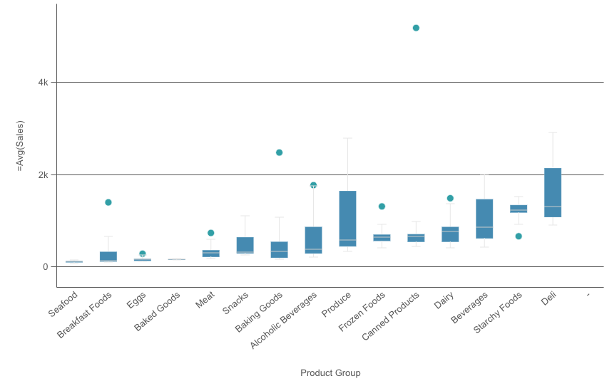
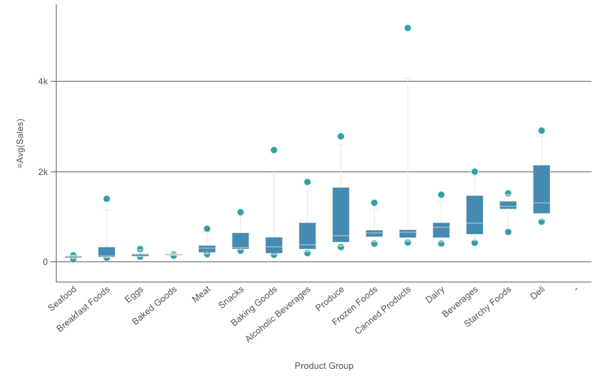
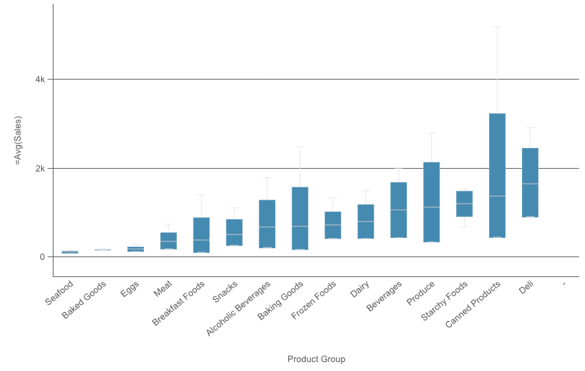
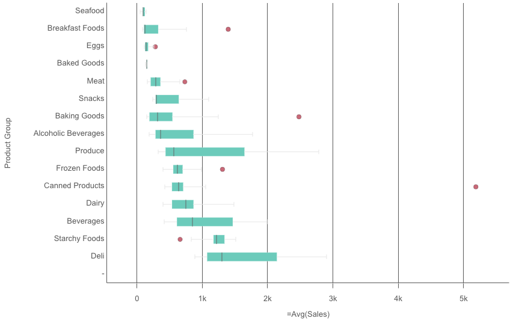

# @nebula.js/sn-boxplot

The box plot is suitable for comparing range and distribution for groups of numerical data, illustrated by a box with whiskers, and a center line in the middle. The whiskers represent high and low reference values for excluding outlier values.

## Requirements

Requires `@nebula.js/stardust` version `1.4.0` or later.

## Installing

If you use pnpm: `pnpm install @nebula.js/sn-boxplot`. You can also load through the script tag directly from [https://unpkg.com](https://unpkg.com/@nebula.js/sn-boxplot).

## Usage

<!---->

```js
import { embed } from '@nebula.js/stardust';
import boxplot from '@nebula.js/sn-boxplot';

// 'app' is an enigma app model
const embeddable = embed(app, {
  types: [
    {
      // register box plot chart
      name: 'boxplot',
      load: () => Promise.resolve(boxplot),
    },
  ],
});

embeddable.render({
  element,
  type: 'boxplot',
  fields: ['Region', 'Product Group', '=Avg(Sales)'],
});
```

## More examples

### Percentile-based

This preset is defined with the box start and end points representing the first and third quartiles, and the center line representing the median, but the whisker length is adjusted by setting a percentile based whisker position. The example is using 5th/95th percentile. Setting `mode` in `calculations` to `fractiles` and `fractiles` in `parameters` to `0.05`.

<!---->

```js
// 'app' is an enigma app model
embeddable.render({
  element,
  type: 'boxplot',
  fields: ['Region', 'Product Group', '=Avg(Sales)'],
  // overrides default properties
  properties: {
    boxplotDef: {
      calculations: {
        auto: true,
        mode: 'fractiles',
        parameters: {
          tukey: 1.5,
          fractiles: 0.05,
          stdDev: 3,
        },
      },
      color: {
        auto: true,
      },
      elements: {
        outliers: {
          include: true,
          sortOutliers: true,
        },
      },
      presentation: {
        whiskers: {
          show: true,
        },
      },
      qHyperCubeDef: {},
      sorting: {
        autoSort: true,
      },
    },
  },
});
```

### Standard deviation

This preset is based on standard deviations, with the center line representing the average value, and the box start and end points representing one standard deviation variance. You can set the whisker length to a multiple of standard deviations. The example is using two standard deviations. Setting `mode` in `calculations` to `stdDev` and `stdDev` in `parameters` to `3`.

<!---->

```js
// 'app' is an enigma app model
embeddable.render({
  element,
  type: 'boxplot',
  fields: ['Region', 'Product Group', '=Avg(Sales)'],
  // overrides default properties
  properties: {
    boxplotDef: {
      calculations: {
        auto: true,
        mode: 'stdDev',
        parameters: {
          tukey: 1.5,
          fractiles: 0.05,
          stdDev: 3,
        },
      },
      color: {
        auto: true,
      },
      elements: {
        outliers: {
          include: true,
          sortOutliers: true,
        },
      },
      presentation: {
        whiskers: {
          show: true,
        },
      },
      qHyperCubeDef: {},
      sorting: {
        autoSort: true,
      },
    },
  },
});
```

### Customized box plot

The example defines `elements` using custom expressions, `color` and `orientation`.

The example based on the original box plot definition by J. Tukey. The center line represents the median (second quartile), and the box start and end points represent the first and third quartiles. Whisker length is set to 2 inter-quartile ranges. An inter-quartile range represents the difference between the first and third quartiles.

<!---->

```js
// 'app' is an enigma app model
embeddable.render({
  element,
  type: 'boxplot',
  fields: ['Region', 'Product Group', '=Avg(Sales)'],
  // overrides default properties
  properties: {
    boxplotDef: {
      calculations: {
        auto: false,
        mode: 'tukey',
        parameters: {
          tukey: 2,
          fractiles: 0.05,
          stdDev: 3,
        },
      },
      color: {
        auto: false,
        box: {
          paletteColor: {
            color: '#66ccbb',
            index: -1,
          },
        },
        point: {
          paletteColor: {
            color: '#cc6677',
            index: -1,
          },
        },
      },
      elements: {
        firstWhisker: {
          name: '',
          expression: {
            qValueExpression: {
              qExpr:
                'Rangemax(Fractile( total <[Product Group]> Aggr( Avg(Sales), [Product Group], [Region] ) ,0.25 ) - ((Fractile( total <[Product Group]> Aggr( Avg(Sales), [Product Group], [Region] ) ,0.75 ) - Fractile( total <[Product Group]> Aggr( Avg(Sales), [Product Group], [Region] ) ,0.25 )) * 2), Min( total <[Product Group]> Aggr( Avg(Sales), [Product Group], [Region] )  ))',
            },
          },
        },
        boxStart: {
          name: '',
          expression: {
            qValueExpression: {
              qExpr: 'Fractile( total <[Product Group]> Aggr( Avg(Sales), [Product Group], [Region] ) ,0.25 )',
            },
          },
        },
        boxMiddle: {
          name: '',
          expression: {
            qValueExpression: {
              qExpr: 'Median( total <[Product Group]> Aggr( Avg(Sales), [Product Group], [Region] )  )',
            },
          },
        },
        boxEnd: {
          name: '',
          expression: {
            qValueExpression: {
              qExpr: 'Fractile( total <[Product Group]> Aggr( Avg(Sales), [Product Group], [Region] ) ,0.75 )',
            },
          },
        },
        lastWhisker: {
          name: '',
          expression: {
            qValueExpression: {
              qExpr:
                'Rangemin(Fractile( total <[Product Group]> Aggr( Avg(Sales), [Product Group], [Region] ) ,0.75 ) + ((Fractile( total <[Product Group]> Aggr( Avg(Sales), [Product Group], [Region] ) ,0.75 ) - Fractile( total <[Product Group]> Aggr( Avg(Sales), [Product Group], [Region] ) ,0.25 )) * 2), Max( total <[Product Group]> Aggr( Avg(Sales), [Product Group], [Region] )  ))',
            },
          },
        },
        outliers: {
          include: true,
          sortOutliers: true,
        },
      },
      presentation: {
        whiskers: {
          show: true,
        },
      },
      qHyperCubeDef: {},
      sorting: {
        autoSort: true,
      },
    },
    orientation: 'horizontal',
  },
});
```
