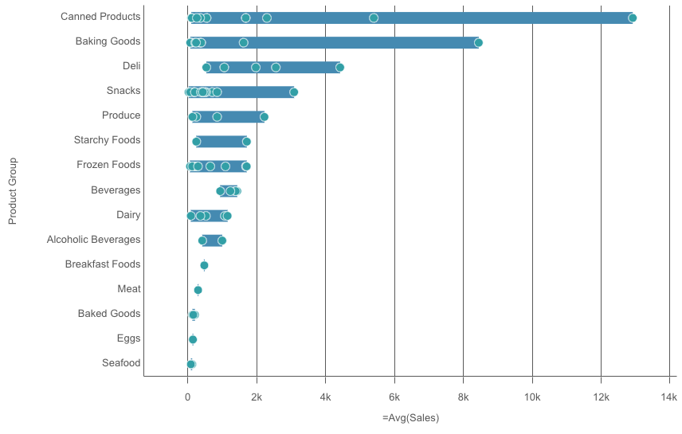
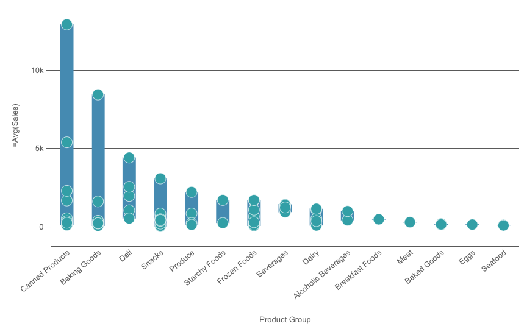
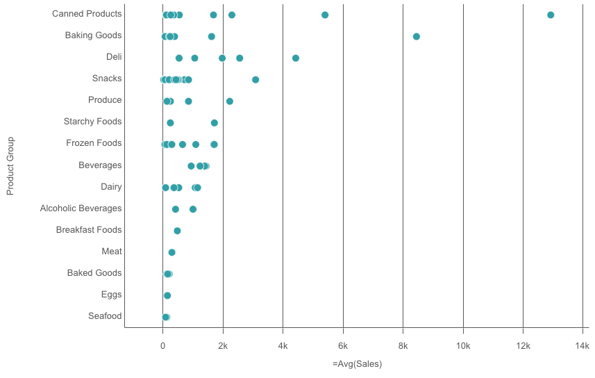
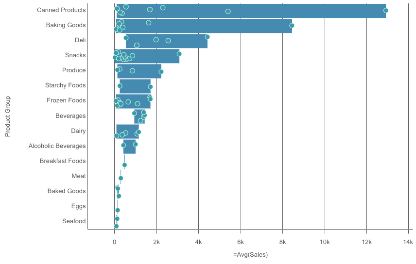

# @nebula.js/sn-distributionplot

The distribution plot is suitable for comparing range and distribution for groups of numerical data. Data is plotted as value points along an axis.

## Requirements

Requires `@nebula.js/stardust` version `1.4.0` or later.

## Installing

If you use pnpm: `pnpm install @nebula.js/sn-distributionplot`. You can also load through the script tag directly from [https://unpkg.com](https://unpkg.com/@nebula.js/sn-distributionplot).

## Usage

In a distribution plot you need to use one or two dimensions, and one measure. If you use a single dimension you will receive a single line visualization. If you use two dimensions, you will get one line for each value of the second, or outer, dimension.

<!---->

```js
import { embed } from '@nebula.js/stardust';
import distributionplot from '@nebula.js/sn-distributionplot';

// 'app' is an enigma app model
const embeddable = embed(app, {
  types: [
    {
      // register distribution plot chart
      name: 'distributionplot',
      load: () => Promise.resolve(distributionplot),
    },
  ],
});

embeddable.render({
  element,
  type: 'distributionplot',
  fields: ['Product Sub Group', 'Product Group', '=Avg(Sales)'],
});
```

## More examples

### Vertical distribution plot

Setting `orientation` property value to `vertical`. Default value is `horizontal`.

<!---->

```js
embeddable.render({
  element,
  type: 'distributionplot',
  fields: ['Product Sub Group', 'Product Group', '=Avg(Sales)'],
  // overrides default properties
  properties: {
    orientation: 'vertical',
  },
});
```

### Different ways to present distribution plot

#### Points only

Displays value points only.

<!---->

```js
embeddable.render({
  element,
  type: 'distributionplot',
  fields: ['Product Sub Group', 'Product Group', '=Avg(Sales)'],
  // overrides default properties
  properties: {
    presentation: {
      visibleComponents: 'points',
    },
  },
});
```

#### Background only

Displays a bounding box showing the range of the values only.

<!---->

```js
embeddable.render({
  element,
  type: 'distributionplot',
  fields: ['Product Sub Group', 'Product Group', '=Avg(Sales)'],
  // overrides default properties
  properties: {
    presentation: {
      visibleComponents: 'box',
    },
  },
});
```

#### Bubble size and jitter

You can adjust the size of the bubbles that illustrate the value points by setting `bubbleScales` value.

You can set `displacement` to `jitter` to jitter several overlapping value points. This moves some of the points slightly to create a larger footprint that shows that there are more than one value behind the point.

<!---->

```js
embeddable.render({
  element,
  type: 'distributionplot',
  fields: ['Product Sub Group', 'Product Group', '=Avg(Sales)'],
  // overrides default properties
  properties: {
    dataPoint: {
      bubbleScales: 90,
      displacement: 'jitter',
    },
  },
});
```
