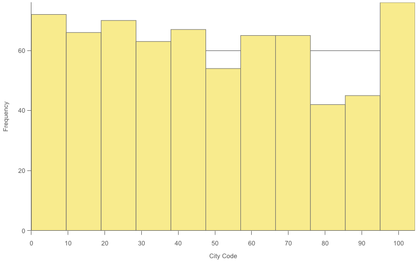
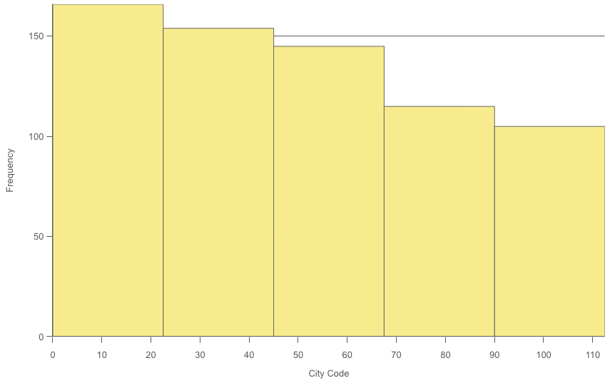
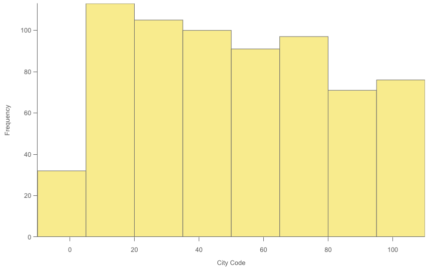
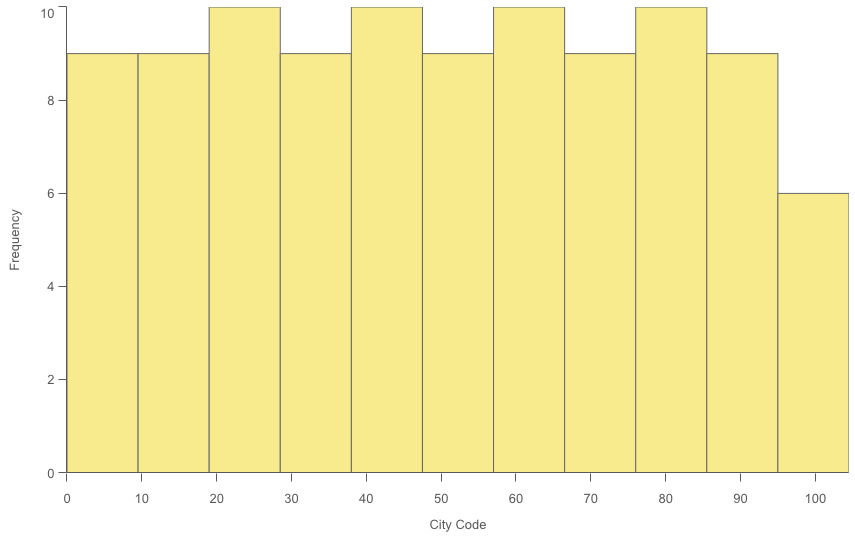

# @nebula.js/sn-histogram

The histogram is suitable for visualizing distribution of numerical data over a continuous interval, or a certain time period. The data is divided into bins, and each bar in a histogram represents the tabulated frequency at each bin.

## Requirements

Requires `@nebula.js/stardust` version `1.4.0` or later.

## Installing

If you use pnpm: `pnpm install @nebula.js/sn-histogram`. You can also load through the script tag directly from [https://unpkg.com](https://unpkg.com/@nebula.js/sn-histogram).

## Usage

<!-- -->

```js
import { embed } from '@nebula.js/stardust';
import histogram from '@nebula.js/sn-histogram';

// 'app' is an enigma app model
const embeddable = embed(app, {
  types: [
    {
      // register histogram chart
      name: 'histogram',
      load: () => Promise.resolve(histogram),
    },
  ],
});

embeddable.render({
  element,
  type: 'histogram',
  fields: ['City Code'],
  }
});
```

## More examples

### Number of bars

Set maximum number to the number of bars you want to divide the data into. Setting `binMode` property to `maxCount` and set `binCount` to the number of bars that you want the chart to display.

<!-- -->

```js
embeddable.render({
  element,
  type: 'histogram',
  fields: ['City Code'],
  // overrides default properties
  properties: {
    bins: {
      auto: false,
      binMode: 'maxCount',
      binCount: 5,
      binSize: 10,
      offset: 0,
      countDistinct: false,
    },
  },
});
```

### Bar width (x-axis)

Set width to define how wide each bar is. This is based on the values on the x-axis. You can offset the bars by changing the Offset setting. If you set Width to 2 and keep the default Offset setting 0, your bars may be defined 0 to 2, 2 to 4, 4 to 6, and so on. If you change Offset to 1, the bars are defined -1 to 1, 1 to 3, 3 to 5, and so on.

Setting `binMode` property to `size` and set `binSize` and `offset` to desired numbers.

<!-- -->

```js
embeddable.render({
  element,
  type: 'histogram',
  fields: ['City Code'],
  // overrides default properties
  properties: {
    bins: {
      auto: false,
      binMode: 'size',
      binCount: '',
      binSize: 15,
      offset: 5,
      countDistinct: false,
    },
  },
});
```

### Count distinct values only

Setting `countDistinct` property to `true` to exclude duplicate values.

<!-- -->

```js
embeddable.render({
  element,
  type: 'histogram',
  fields: ['City Code'],
  // overrides default properties
  properties: {
    bins: {
      auto: true,
      binMode: 'maxCount',
      binCount: '',
      binSize: 10,
      offset: 0,
      countDistinct: true,
    },
  },
});
```
