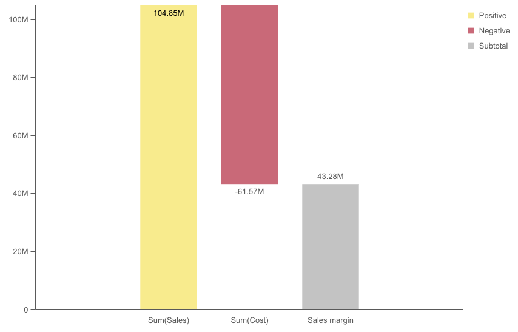
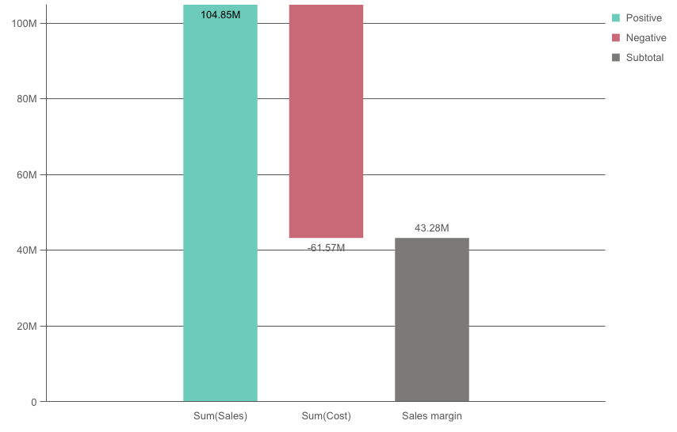

# @nebula.js/sn-waterfall

The waterfall chart is suitable for illustrating how an initial value is affected by intermediate positive and negative values. The starting and the final values are represented by whole bars, and intermediate values by floating bars. You can also show subtotals in the chart.

## Requirements

Requires `@nebula.js/stardust` version `1.4.0` or later.

## Installing

If you use pnpm: `pnpm install @nebula.js/sn-waterfall`. You can also load through the script tag directly from [https://unpkg.com](https://unpkg.com/@nebula.js/sn-waterfall).

## Usage

In a waterfall chart you need to use one measure for each bar in the chart. The order of the measures defines the order of the bars in the chart. For each measure, you need to define how it affects the previous value. You can add up to 30 measures in a waterfall chart.

You can use the Measure operation option (`Add/Subtract/Subtotals`) of each measure to set how it affects the previous value by setting `valueType` property to `NORMAL/INVERSE/SUBTOTAL`.

- Add. The measure value adds to the previous bar. If this is the first measure, a whole bar is shown starting at 0. Setting `valueType` to `NORMAL`.

- Subtract. The measure value subtracts from the previous bar. Setting `valueType` to `INVERSE`.

- Subtotals. The measure value is considered a subtotal. Setting `valueType` to `SUBTOTAL`.

<!---->

```js
import { embed } from '@nebula.js/stardust';
import waterfall from '@nebula.js/sn-waterfall';

// 'app' is an enigma app model
const embeddable = embed(app, {
  types: [
    {
      // register waterfall chart
      name: 'waterfall',
      load: () => Promise.resolve(waterfall),
    },
  ],
});

embeddable.render({
  element,
  type: 'waterfall',
  fields: [],
  // overrides default properties
  properties: {
    qHyperCubeDef: {
      qMeasures: [
        {
          qDef: {
            qDef: 'Sum(Sales)',
            valueType: 'NORMAL',
            subtotal: {
              enable: false,
              label: 'Subtotals',
            },
          },
        },
        {
          qDef: {
            qDef: 'Sum(Cost)',
            valueType: 'INVERSE',
            subtotal: {
              enable: true,
              label: 'Sales margin',
            },
          },
        },
      ],
      qInitialDataFetch: [
        {
          qLeft: 0,
          qTop: 0,
          qWidth: 200,
          qHeight: 10,
        },
      ],
    },
  },
});
```

## More examples

### Colors

You can set the presentation color for the different measure operations: Positive value color, Negative value color or Subtotal color

<!---->

```js
embeddable.render({
  element,
  type: 'waterfall',
  fields: [],
  // overrides default properties
  properties: {
    qHyperCubeDef: {
      qMeasures: [
        {
          qDef: {
            qDef: 'Sum(Sales)',
            valueType: 'NORMAL',
            subtotal: {
              enable: false,
              label: 'Subtotals',
            },
          },
        },
        {
          qDef: {
            qDef: 'Sum(Cost)',
            valueType: 'INVERSE',
            subtotal: {
              enable: true,
              label: 'Sales margin',
            },
          },
        },
      ],
      qInitialDataFetch: [
        {
          qLeft: 0,
          qTop: 0,
          qWidth: 200,
          qHeight: 10,
        },
      ],
    },
    color: {
      auto: false,
      positiveValue: {
        paletteColor: {
          index: -1,
          color: '#66CCBB',
        },
      },
      negativeValue: {
        paletteColor: {
          index: -1,
          color: '#cc6677',
        },
      },
      subtotal: {
        paletteColor: {
          index: -1,
          color: '#7b7a78',
        },
      },
    },
  },
});
```
